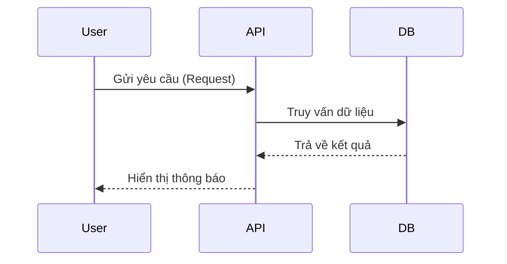

# Thiết kế kỹ thuật: [Tên tính năng]

## 1. Tổng quan
Mô tả ngắn gọn tính năng này làm gì.

## 2. Sơ đồ luồng (Flowchart)



## 3. Thay đổi Database
Cần chạy câu lệnh SQL nào?

```sql
ALTER TABLE users ADD COLUMN is_active BOOLEAN DEFAULT true;
```

## 4. API Endpoints
| Method | Endpoint | Mô tả |
| :--- | :--- | :--- |
| POST | `/api/v1/resource` | Tạo mới |
| GET | `/api/v1/resource/{id}` | Lấy chi tiết |